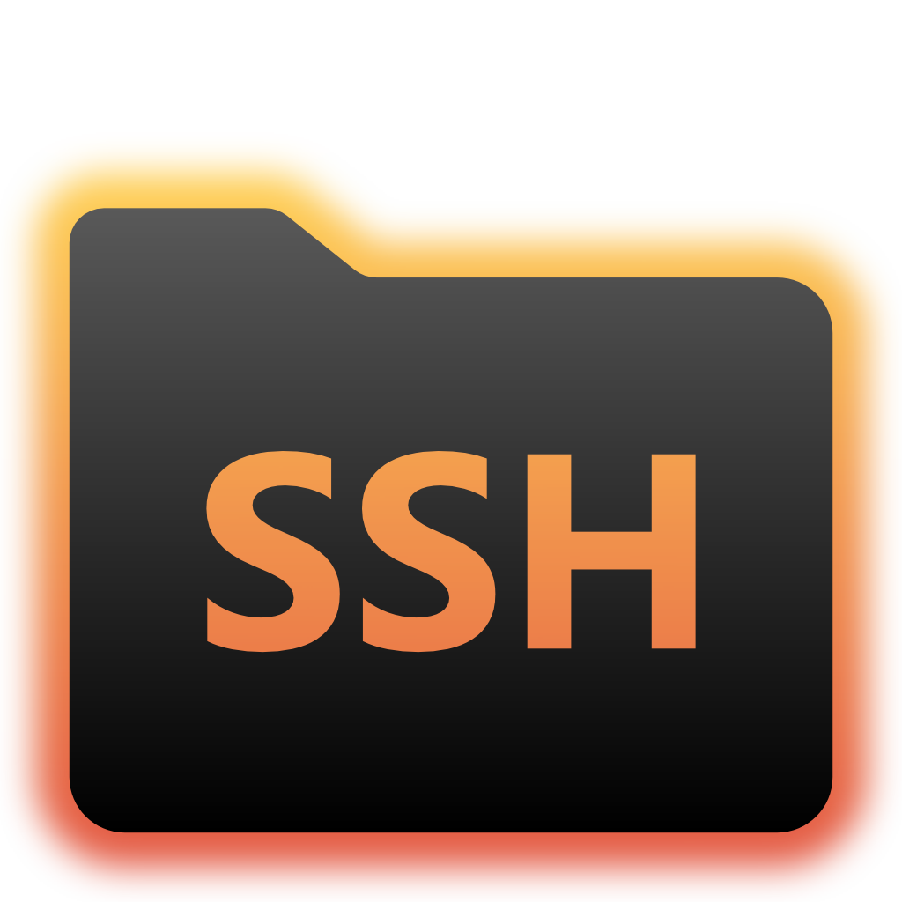

<h1 align="center">
    
    <br/>
    <br/>
    SSHFS-Win &middot; SSHFS for Windows
</h1>

<p align="center">
    <b>Download</b><br>
    <a href="https://github.com/billziss-gh/sshfs-win/releases/latest">
        
    </a>
    <a href="https://github.com/billziss-gh/sshfs-win/releases">
        
    </a>
    <!-- a href="https://chocolatey.org/packages/sshfs">
        
    </a -->
</p>

<p align="center">
    <b>GUI Frontends</b><br>
    <a href="https://github.com/mhogomchungu/sirikali/releases/latest">
        
    </a>
    <a href="https://github.com/evsar3/sshfs-win-manager/releases/latest">
        
    </a>
</p>

SSHFS-Win is a minimal port of [SSHFS](https://github.com/libfuse/sshfs) to Windows. Under the hood it uses [Cygwin](https://cygwin.com) for the POSIX environment and [WinFsp](https://github.com/billziss-gh/winfsp) for the FUSE functionality.

## Installation

- Install the latest version of [WinFsp](https://github.com/billziss-gh/winfsp/releases/latest).
- Install the latest version of [SSHFS-Win](https://github.com/billziss-gh/sshfs-win/releases). Choose the x64 or x86 installer according to your computer's architecture.

## Basic Usage

Once you have installed WinFsp and SSHFS-Win you can map a network drive to a directory on an SSHFS host using Windows Explorer or the `net use` command.

### Windows Explorer

In Windows Explorer select This PC > Map Network Drive and enter the desired drive letter and SSHFS path using the following UNC syntax:

    \\sshfs\REMUSER@HOST[\PATH]

The first time you map a particular SSHFS path you will be prompted for the SSHFS username and password. You may choose to save these credentials with the Windows Credential Manager in which case you will not be prompted again.

In order to unmap the drive, right-click on the drive icon in Windows Explorer and select Disconnect.

<p align="center">

</p>

### Command Line

You can map a network drive from the command line using the `net use` command:

```
> net use X: \\sshfs\billziss@mac2018.local
The password is invalid for \\sshfs\billziss@mac2018.local.

Enter the user name for 'sshfs': billziss
Enter the password for sshfs:
The command completed successfully.
```

You can list your `net use` drives:

```
$ net use
New connections will be remembered.


Status       Local     Remote                    Network

-------------------------------------------------------------------------------
             X:        \\sshfs\billziss@mac2018.local
                                                WinFsp.Np
The command completed successfully.
```

Finally you can unmap the drive as follows:

```
$ net use X: /delete
X: was deleted successfully.
```

## UNC Syntax

The complete UNC syntax is as follows:

    \\sshfs\[LOCUSER=]REMUSER@HOST[!PORT][\PATH]
    \\sshfs.r\[LOCUSER=]REMUSER@HOST[!PORT][\PATH]
    \\sshfs.k\[LOCUSER=]REMUSER@HOST[!PORT][\PATH]
    \\sshfs.kr\[LOCUSER=]REMUSER@HOST[!PORT][\PATH]

- `REMUSER` is the remote user (i.e. the user on the SSHFS host whose credentials are being used for access).
- `HOST` is the SSHFS host.
- `PORT` is the remote port on the SSHFS host (optional; default is 22).
- `PATH` is the remote path. This is interpreted as follows:
    - The `sshfs` prefix maps to `HOST:~REMUSER/PATH` on the SSHFS host (i.e. relative to `REMUSER`'s home directory).
    - The `sshfs.r` prefix maps to `HOST:/PATH` on the SSHFS host (i.e. relative to the `HOST`'s root directory).
    - The `sshfs.k` prefix maps to `HOST:~REMUSER/PATH` and uses the ssh key in `%USERPROFILE%/.ssh/id_rsa` (where `%USERPROFILE%` is the home directory of the local Windows user).
    - The `sshfs.kr` prefix maps to `HOST:/PATH` and uses the ssh key in `%USERPROFILE%/.ssh/id_rsa`.
- `LOCUSER` is the local Windows user (optional; `USERNAME` or `DOMAIN+USERNAME` format).
    - Please note that this functionality is rarely necessary with latest versions of WinFsp.

## GUI front ends

There are currently 2 GUI front ends for SSHFS-Win: [SiriKali](https://mhogomchungu.github.io/sirikali/) and [SSHFS-Win-Manager](https://github.com/evsar3/sshfs-win-manager).

### SiriKali

[SiriKali](https://mhogomchungu.github.io/sirikali/) is a GUI front end for SSHFS-Win (and other file systems). Instructions on setting up SiriKali for SSHFS-Win can be found at this [link](https://github.com/mhogomchungu/sirikali/wiki/Frequently-Asked-Questions#90-how-do-i-add-options-to-connect-to-an-ssh-server). Please report problems with SiriKali in its [issues](https://github.com/mhogomchungu/sirikali/issues) page.

SiriKali supports:

- Password authentication.
- Public key authentication.
- Key Agents and KeePass 2.

### SSHFS-Win-Manager

[SSHFS-Win-Manager](https://github.com/evsar3/sshfs-win-manager) is a new GUI front end specifically for SSHFS-Win with a user-friendly and intuitive interface. SSHFS-Win-Manager integrates well with Windows and can be closed to the system tray. Please report problems with SSHFS-Win-Manager in its [issues](https://github.com/evsar3/sshfs-win-manager/issues) page.

SSHFS-Win-Manager supports:

- Password authentication.
- Public key authentication.

## Advanced Usage

It is possible to use the `sshfs-win.exe` and `sshfs.exe` programs directly for advanced usage scenarios. Both programs can be found in the `bin` subdirectory of the `SSHFS-Win` installation (usually `\Program Files\SSHFS-Win\bin`).

The `sshfs-win.exe` program is useful to launch `sshfs.exe` from a `cmd.exe` prompt (`sshfs-win cmd`) or to launch `sshfs.exe` under the control of the [WinFsp Launcher](https://github.com/billziss-gh/winfsp/wiki/WinFsp-Service-Architecture) (`sshfs-win svc`). The `sshfs-win.exe` program **SHOULD NOT** be used from Cygwin. The `sshfs-win.exe` program has the following usage:

```
usage: sshfs-win cmd SSHFS_COMMAND_LINE
    SSHFS_COMMAND_LINE  command line to pass to sshfs

usage: sshfs-win svc PREFIX X: [LOCUSER] [SSHFS_OPTIONS]
    PREFIX              Windows UNC prefix (note single backslash)
                        \sshfs[.SUFFIX]\[LOCUSER=]REMUSER@HOST[!PORT][\PATH]
                        sshfs: remote user home dir
                        sshfs.r: remote root dir
                        sshfs.k: remote user home dir with key authentication
                        sshfs.kr: remote root dir with key authentication
    LOCUSER             local user (DOMAIN+USERNAME)
    REMUSER             remote user
    HOST                remote host
    PORT                remote port
    PATH                remote path (relative to remote home or root)
    X:                  mount drive
    SSHFS_OPTIONS       additional options to pass to SSHFS
```

The `sshfs.exe` program can be used with an existing Cygwin installation, but it requires prior installation of FUSE for Cygwin on that Cygwin installation. FUSE for Cygwin is included with WinFsp and can be installed on a Cygwin installation by executing the command:

```
$ sh "$(cat /proc/registry32/HKEY_LOCAL_MACHINE/SOFTWARE/WinFsp/InstallDir | tr -d '\0')"/opt/cygfuse/install.sh
FUSE for Cygwin installed.
```

## Project Organization

This is a simple project:

- `sshfs` is a submodule pointing to the original SSHFS project.
- `sshfs-win.c` is a simple wrapper around the sshfs program that is used to implement the "Map Network Drive" functionality.
- `sshfs-win.wxs` is a the Wix file that describes the SSHFS-Win installer.
- `patches` is a directory with a couple of simple patches over SSHFS.
- `Makefile` drives the overall process of building SSHFS-Win and packaging it into an MSI.

## Building

In order to build SSHFS-Win you will need Cygwin and the following Cygwin packages:

- gcc-core
- git
- libglib2.0-devel
- make
- meson
- patch

You will also need:

- FUSE for Cygwin. It is included with WinFsp and can be installed on a Cygwin installation by executing the command:

    ```
    $ sh "$(cat /proc/registry32/HKEY_LOCAL_MACHINE/SOFTWARE/WinFsp/InstallDir | tr -d '\0')"/opt/cygfuse/install.sh
    FUSE for Cygwin installed.
    ```
- [Wix toolset](http://wixtoolset.org). This is a native Windows package that is used to build the SSHFS-Win MSI installer.

To build:

- Open a Cygwin prompt.
- Change directory to the sshfs-win repository.
- Issue `make`.
- The sshfs-win repository includes the upstream SSHFS project as a submodule; if you have not already done so, you must initialize it with `git submodule update --init sshfs`.

## License

SSHFS-Win uses the same license as SSHFS, which is GPLv2+. It interfaces with WinFsp which is GPLv3 with a FLOSS exception.

It also packages the following components:

- Cygwin: LGPLv3
- GLib2: LGPLv2
- SSH: "all components are under a BSD licence, or a licence more free than that"
